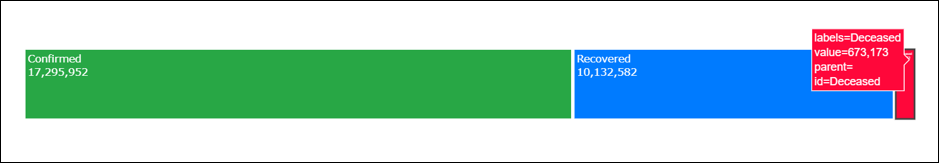
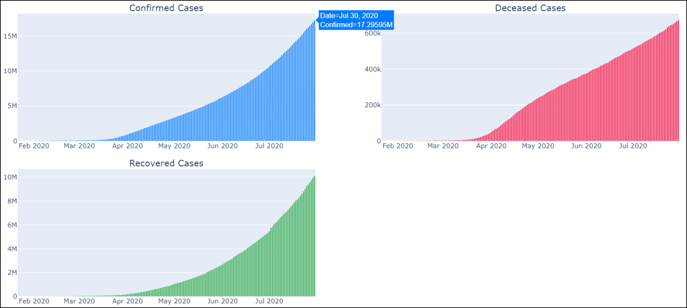
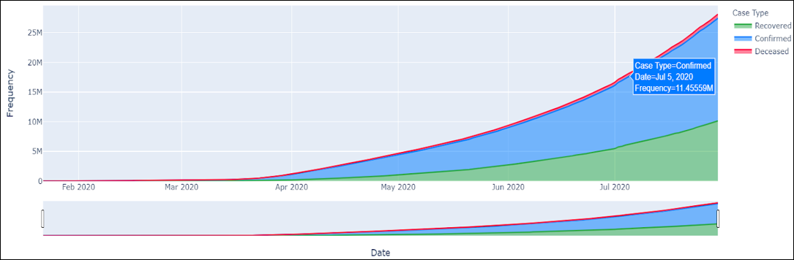
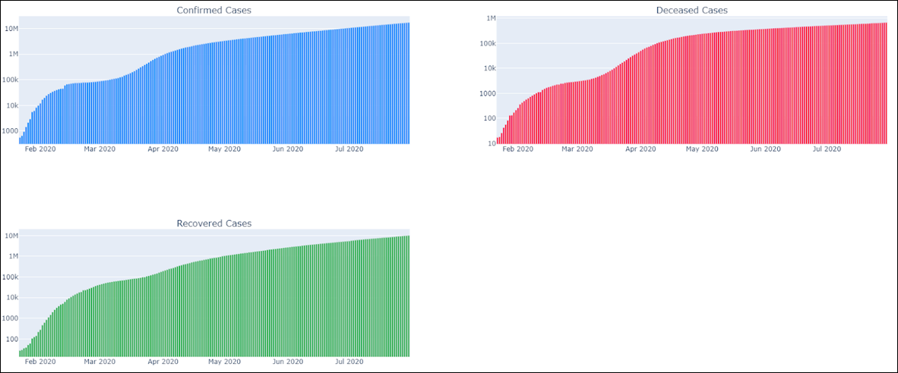
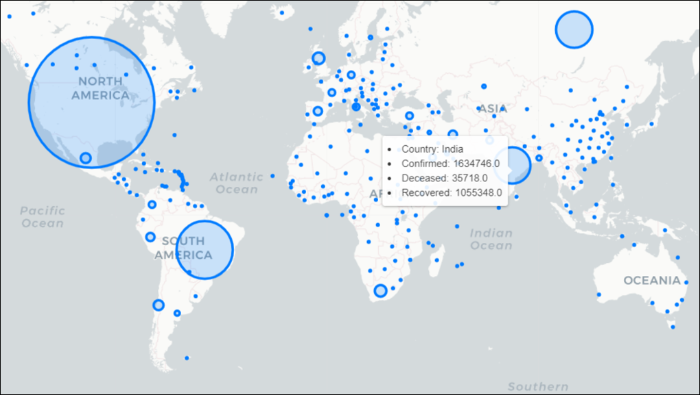
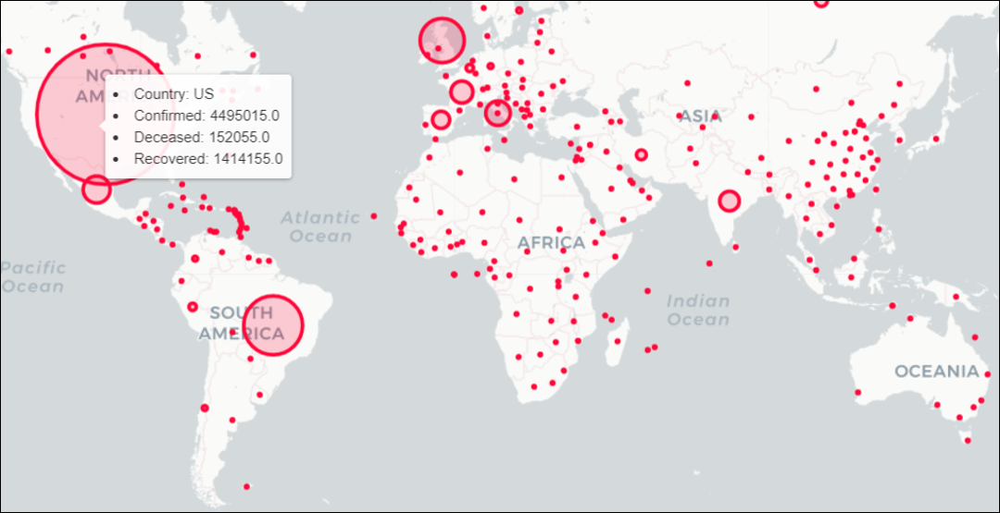
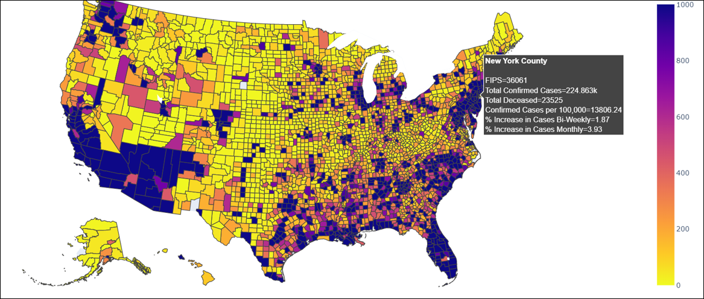
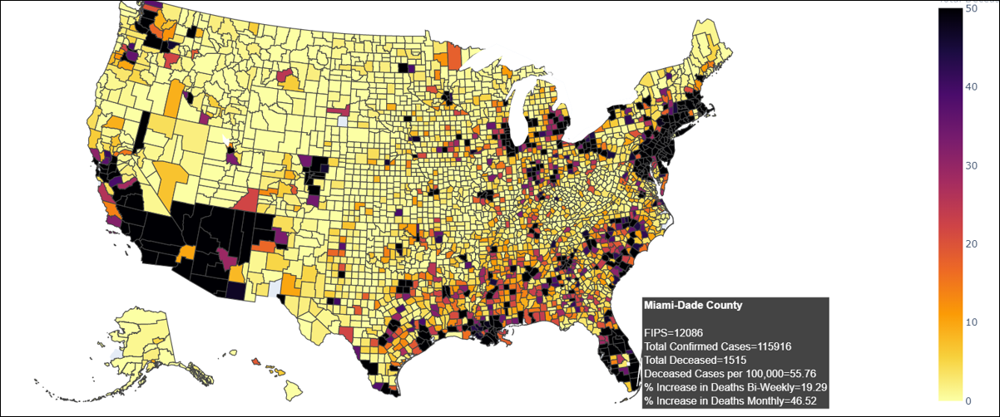
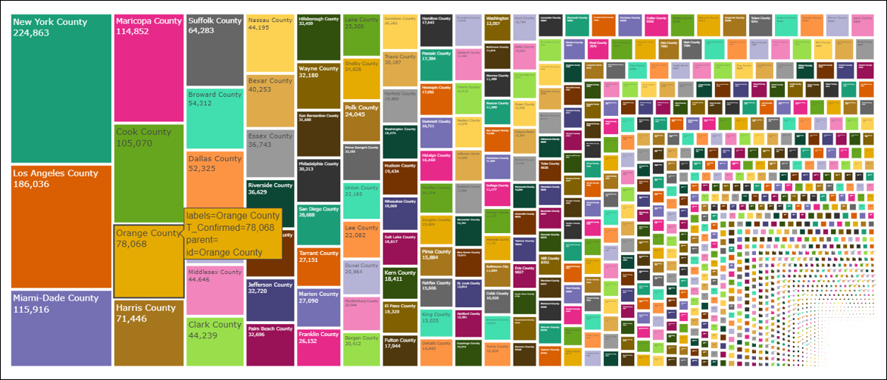
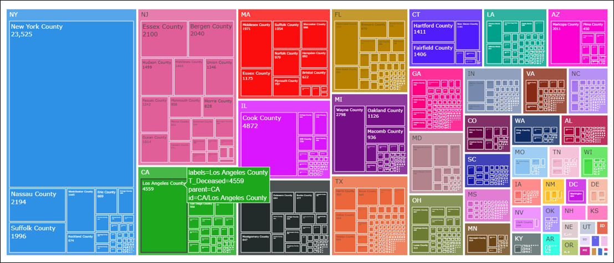

# COVID19 Visualizations
As the economy is still struggling with the impact of the covid19 pandemic, all developers around the globe are striving towards helping the general population as much as they possibly can. 
Many have created covid19 apps and websites to show stats on the pandemic whereas others are creating applications that help track people who were in contact with the newly infected person. 
As a developer, I have created a COVID19 statistic visualization which not only helps my colleagues and family but also myself. 

This project showcases many eye-catching visualizations. I have majorly focused on confirmed cases, deaths, recovered, and percentage data of growth globally and county wise in the United States. 

## Pre-requisites
- For the visualization, I am using Kaggle’s virtual machines instead of the local Jupyter lab or Jupiter notebook. It is much easier to import-export datasets as well as avoid some issues which I faced during visualization.

<b>Note:</b> There are some issues in the Jupiter lab/notebook while showing Plotly graphs. This occurs due to multiple versions of Python. You could resolve it using these troubleshooting methods.
- For more information on Kaggle, refer to this article from GeeksforGeeks.
- We are using two county datasets. One from covid19-county and another from usa-county-info Kaggle datasets. You have to either download the files separately (in case you are using local Jupiter) or import these datasets using the ‘Add Data’ option on the right side of Kaggle VM.

covid19-county dataset URL: https://www.kaggle.com/devavratkalam/covid19county

usa-county-info dataset URL: https://www.kaggle.com/kkbk58901/usa-county-info

## Implementation Instructions
- Clone the repository
- Open the file 'covid19_visualization.ipynb' in jupyter notebook or jupyter lab or kaggle's VM(recommended).
- Run the file

<b>Note:</b> If the plotly graphs are not visible on jupyter notebook/ jupyterlab, follow this troubleshoot guide link for more information. 

Link: https://plotly.com/python/troubleshooting/

## Global Stats
### Line Tree Map

### Pie Chart

### Area Chart

### Bar Chart

### Bar Chart Logarithmic

### Confirmed cases Map

### Deceased cases Map

## US based Stats
### County wise Confirmed cases Choropleth

### County wise Deceased cases Choropleth

### County wise Confirmed cases TreeMap

### State-County wise Deceased TreeMap

