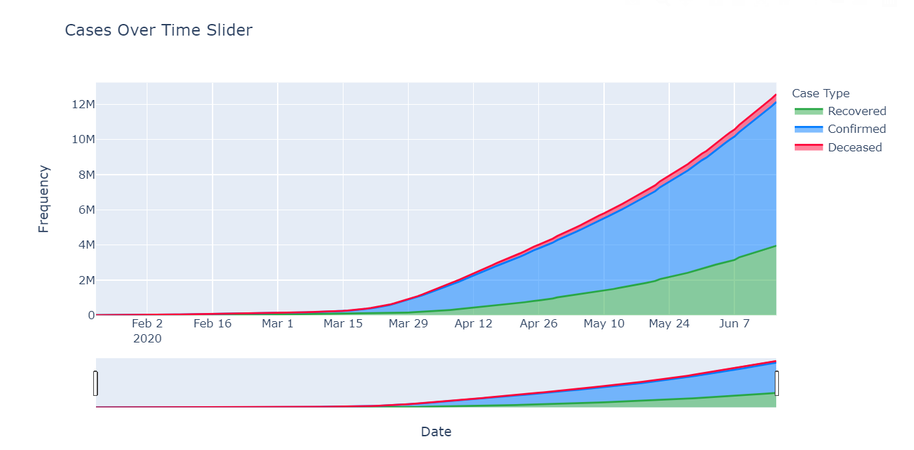
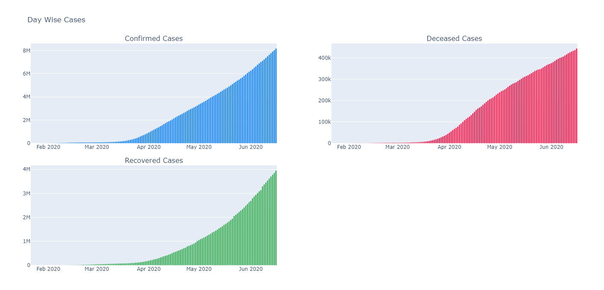
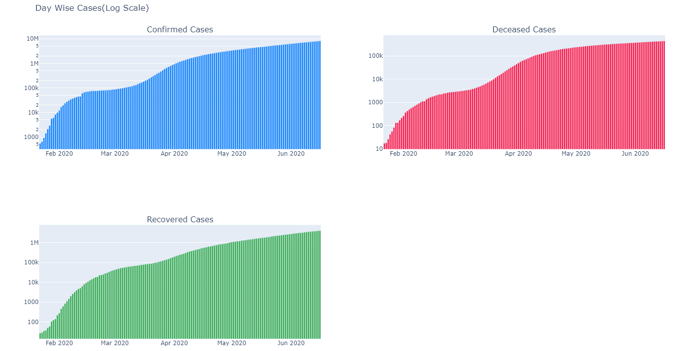
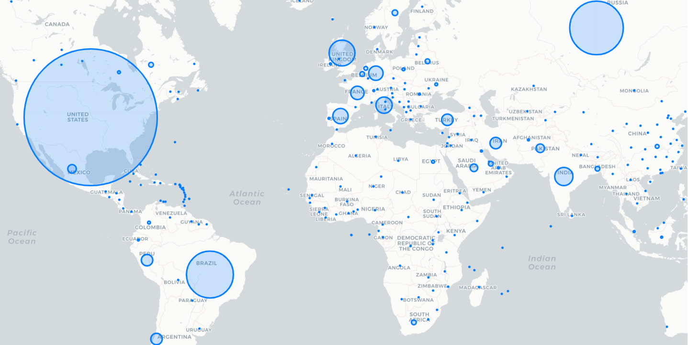
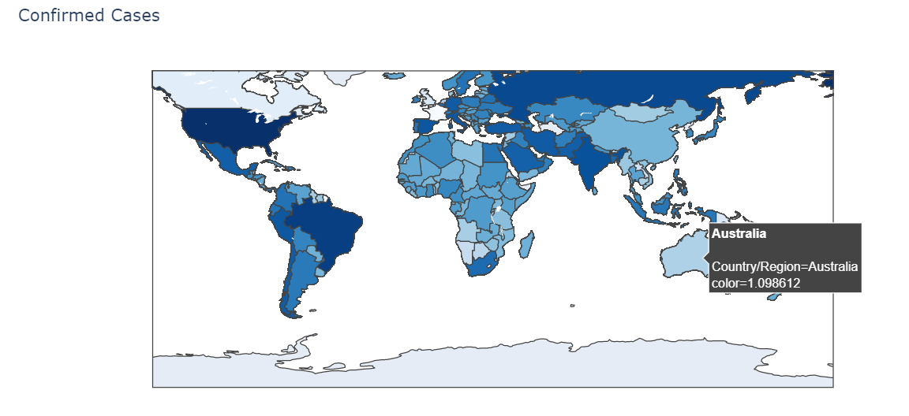

# COVID19 Visualizations
As the economy is still struggling with the impact of the covid19 pandemic, all developers around the globe are striving towards helping the general population as much as they possibly can. Many have created covid19 apps and websites to show stats on the pandemic whereas others are creating applications that help track people who were in contact with the newly infected person. As a developer, I have created a COVID19 statistic visualization which not only helps my colleagues and family but also myself. 

This project showcases many eye-catching visualizations. I have majorly focused on confirmed cases, deaths, recovered, and percentage data of growth globally and county wise in the United States. 

<h1>Data Visualization</h1>
<h2>Area Chart with Slider</h2>

<h2>Bar Charts</h2>

<h2>Bar Charts(Logarithmic)</h2>

<h2>World Map of Impact</h2>

<h2>Choropleth</h2>

## Implementation Instructions
- Clone the repository
- Open the file 'covid19 visualization.ipynb' in jupyter notebook or jupyter lab or kaggle's VM(recommended).
- Run the file

<b>Note:</b> If the plotly graphs are not visible on jupyter notebook/ jupyterlab, follow this troubleshoot guide link for more information. 

Link: https://plotly.com/python/troubleshooting/
